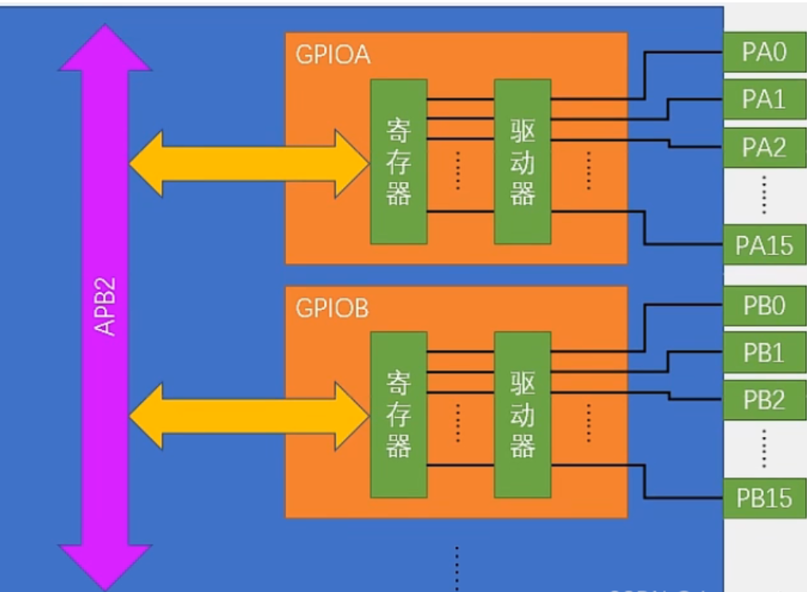
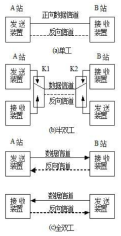
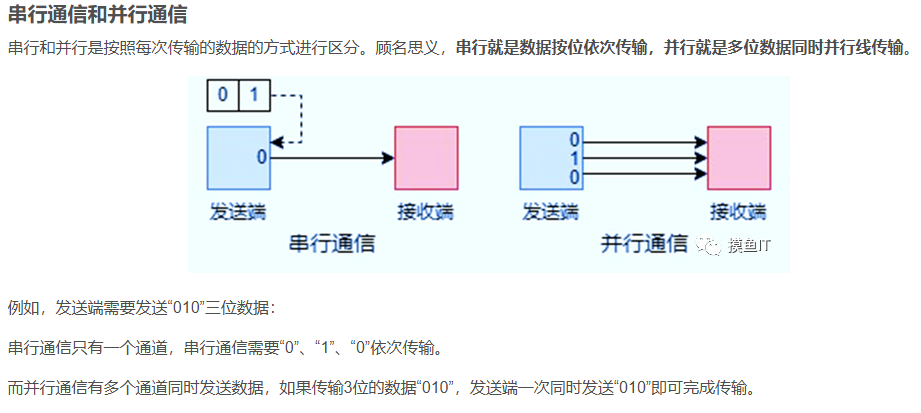
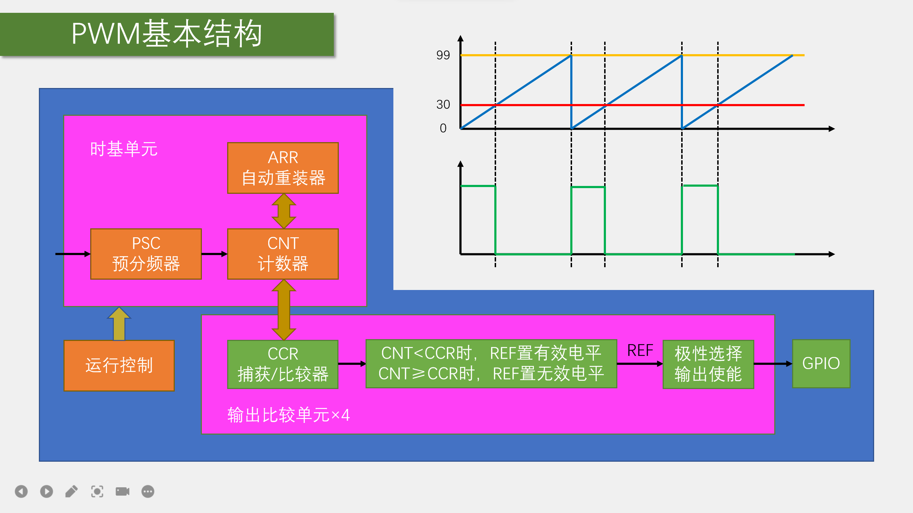
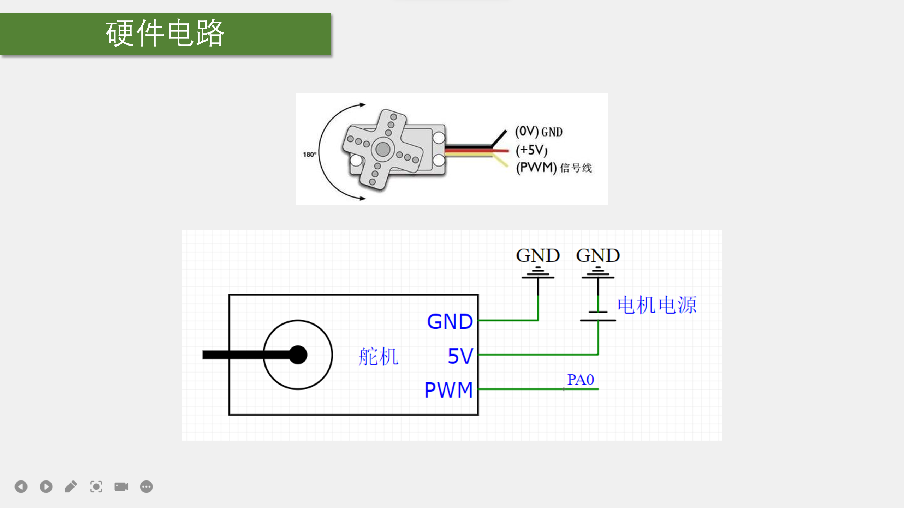

[toc]
# STM32
## 1. 初识 stm32（please不要照搬博客内容 doge） ⽤⾃⼰的话解释以下概念：单⽚机（MCU）、stm32、外设、GPIO、TIM、RTC、同步通信与 异步通信、双⼯和半双⼯、并⾏和串⾏、UART和USART 
  - **MCU**
    - **MCU**（Microcontroller Unit），中文叫**微控制器**，俗称**单片机**，是把CPU的频率与规格做适当缩减，并将内存、计数器、USB、A/D转换、UART、PLC、DMA等周边接口，甚至LCD驱动电路都整合在单一芯片上，形成芯片级的计算机，为不同的应用场合做不同组合控制。
  - **stm32**
    - **STM32**是意法半导体（STMicroelectronics）公司推出的一系列高性能、低功耗的**32位微控制器**，基于ARM Cortex-M内核设计，旨在满足从简单到复杂的嵌入式系统需求，融合了高速处理能力、丰富的外设接口（如ADC、DAC、定时器、通信接口SPI、I2C、USART等）以及灵活的电源管理功能，为开发者提供了强大的硬件支持。其易用的开发工具（如STM32CubeIDE）和广泛的生态系统促进了快速开发与创新。凭借其高性价比、高可靠性和可扩展性，STM32已成为嵌入式系统设计中不可或缺的核心部件。  
  - **外设**
    - 外设指的是*单片机外部的外围功能模块*，比如键盘控制芯片，液晶，A/D转换芯片，等等。外设可通过单片机的I/O，SPI，I2C等总线控制。单片机内部的外设一般包括：串口控制模块，SPI模块，I2C模块，A/D模块，PWM模块，CAN模块，EEPROM，比较器模块，等等，它们都集成在单片机内部，有相对应的内部控制寄存器，可通过单片机指令直接控制。
  - **GPIO**
    - **GPIO**（general purpose input output）是**通用输入输出端口**的简称，简单来说就是软件可控制的引脚，STM32芯片的GPIO引脚与外部设备连接起来，从而实现与外部通讯、控制以及数据采集的功能。
    
    > 八种工作模式
    
  - **TIM**
    - **TIM**是STM32微控制器中一个执行**定时中断**的功能，它允许微控制器根据设定的时间间隔自动触发中断，从而执行特定的任务，根据复杂度可以分为 ***高级定时器、通用定时器和基本定时器*** 三种类型。
    定时中断的基本工作原理是：通过时基单元（包括计数器、预分频器和自动重装载寄存器）对输入的时钟信号进行计数，当计数值达到预设的自动重装载值时，产生更新中断（或更新事件），并重新从0开始计数。这个过程中，预分频器用于对输入时钟进行分频，以调整定时器的计数速度，从而实现对不同时间间隔的定时需求。
    在TIM定时中断的配置过程中，合适的时钟源（可以是内部时钟或外部时钟）和时基单元的参数（如预分频值、自动重装载值等）是必须的。
  - **RTC**
    - **RTC**（Real-Time Clock，**实时时钟**）是一种独立的硬件计时器，它能够在系统断电的情况下持续运行，以提供准确的日期和时间信息。RTC模块通常包含一个计时器电路、一个非易失性存储器（如EEPROM或电池支持的RAM）以及一个振荡器（通常是晶体振荡器，俗称晶振）。这些组件共同工作，确保即使在系统电源关闭时，也能保持时间的准确性和连续性。
  - **同步异步**
    - **同步串行**通信需要时钟线同步，发送端和接收端除了数据线，还需要时钟线进行同步，例如I2C总线。
    因为有时钟线，发送端和接收端在同一个时钟节拍下进行工作。同步通信发送数据后，等待接收端发回响应后再发下一个数据。
    - **异步串行**通信没有时钟线，只是在发送数据中包含起始和结束标志位start/end 相关信息，接收端根据标志位使用本地时钟进行采样，例如UART总线。
    异步通信不需要等待接收端的响应就可以发送下一个数据。异步通信没有统一的时钟节拍，按照各自的内部的时钟节拍进行通信。
    > **同步异步仅在串行下讨论**
  - **双工与半双工**
    - 双工（Duplex Communication）和半双工（Half-Duplex）是网络通信中常见的两种数据传输模式，区别于只支持信号在一个方向上传输（正向或反向）的**单工通信（Simplex）**，数据可以从一端传输到另一端，另一端也能将数据传回
    - 双工通信的狭义理解是**全双工（Full-Duplex）**，允许数据在两个方向上同时进行传输，即在同一时间内，数据可以从一端传输到另一端，同时另一端也能将数据传回。它要求通信双方各自有独立的发送和接收通道，互不干扰。这种通信方式效率最高，因为它实现了数据的即时双向流动，没有等待时间。
    - **半双工（Half-Duplex）**通信也允许数据在两个方向上传输，但与全双工不同的是，它同一时刻只能在一个方向上传输数据。这意味着，如果一方正在发送数据，另一方必须等待发送方完成传输后才能开始发送数据。
    
  - **并⾏串⾏**
    - **并行通信**是指计算机与I/O设备之间通过多条传输线同时进行数据交换的通信方式。在这种方式下，数据的各个位（bit）是同时传输的，可以以字或字节为单位并行进行。并行通信的优点在于传输速度快、效率高，特别适用于实时、快速的数据传输场合。
    - **串行通信**则是指数据按位依次传输的通信方式，每位数据占据一个固定的时间长度，并通过少数几条通信线路进行传输。串行通信的显著特点是传输线少、成本低，特别适用于远距离通信。在串行通信中，数据是一位接一位地顺序传送，因此传输速度相对较慢，但实现简单，且抗干扰能力强。
    
  - **UART & USART**
    - **USART**（Universal Synchronous/Asynchronous Receiver/Transmitter，**通用同步/异步收发传输器**）是一种高级的串行通信接口，可根据数据寄存器的一个字节数据自动生成数据帧时序，从TX引脚发送出去，也可自动接收RX引脚的数据帧时序，拼接为一个字节数据，存放在数据寄存器里，它支持同步和异步两种通信模式。USART提供了五种工作模式，包括*全双工异步模式、半双工同步模式、全双工同步模式、单路半双工模式和IrDA编码器/解码器模式*，以适应不同的应用需求。
    - **UART**（Universal Asynchronous Receiver/Transmitter，**通用异步收发传输器**）是一种异步串行通信协议，它允许计算机与外部设备之间通过串行接口进行数据传输。UART不需要时钟信号来同步数据传输，而是依靠起始位、数据位、校验位（可选）和停止位等信号来标识数据的开始、结束以及进行错误校验。
## 2. 尝试在芯⽚的数据⼿册中找到芯⽚原理图，简述各模块功能
  - **CPU模块**
    - 基于ARM Cortex-M3内核，负责执行程序代码，处理数据和指令，具有高性能、低功耗的特点
  - **存储器模块**
    - Flash存储器，用于存储程序代码和常量数据，通常容量为128KB
  - **SRAM存储器**
    - 用于存储临时数据和变量，通常容量为20KB，提供程序运行所需的存储空间
  - **时钟与复位模块**
    - 包括内部RC振荡器、外部晶体振荡器、PLL锁相环等，提供系统时钟
  - **复位电路**
    - 用于系统复位，恢复初始状态，确保系统稳定、可靠地运行
  - **中断与DMA模块**
    - 实现设备间直接数据传输，减轻CPU负担，提高系统效率和数据处理能力
## 3. 看看芯⽚的外设设备有哪些，试着列举出来
  - **GPIO（通用输入输出）**：多个通用输入输出引脚，支持输入、输出、中断、模拟输入等多种功能
  - **ADC（模数转换器）**：用于将模拟信号转换为数字信号，支持多个通道，可用于信号采集、处理
  - **DAC（数模转换器）**：用于将数字信号转换为模拟信号，实现数字量的输出
  - **USART（通用同步/异步收发传输器）**：支持串口通信，用于与其他设备进行数据交换
  - **SPI（串行外设接口）**：支持高速数据传输，常用于与外部存储器、传感器等设备通信
  - **I2C（串行通信总线）**：用于在微处理器和外部设备之间进行短距离通信
  - **TIM（定时器/计数器）**：包括多个定时器/计数器，用于时间测量、PWM生成等
  - **RTC（实时时钟）**：用于记录和维护精确的实时时间
  - **USB（通用串行总线）**：支持高速数据传输和设备之间的通信
  - **CAN（控制器局域网）**：用于实现实时数据传输和通信，特别适用于工业控制领域
## 4. 串⼝通信理论部分（串⼝参数、时序、TX和RX等）
  - **串口通信**是指外设和计算机之间通过数据信号线、地线等按位进行传输数据的一种通信方式。这种方式遵循按位传输，即每次只传输一位数据。串口通信距离可以从几米到几千米，适用于需要长距离通信的场合，并且相较于并行通信，串口通信所需的数据线少，成本更低。但是由于是按位传输，它的传输速度相对较慢。
  - 串口通信的主要参数包括波特率、数据位、停止位和校验位
    - **波特率**：表示每秒钟传输的比特数（bit/s），是衡量数据传输速率的单位
    - **数据位**：表示每个字符的数据长度，通常为5位、6位、7位或8位，其中8位数据位最为常见
    - **停止位**：用于表示字符的结束，通常为1位或2位。停止位的作用是帮助接收方确定一个字符的传输已经结束，从而可以正确地区分连续传输的字符
    - **校验位**：用于检查数据传输的正确性，包括***无校验、奇校验和偶校验***三种方式,通过特定的校验算法，可以检测数据传输过程中是否发生了错误
  - **TX**代表**发送端（Transmit）**，是串口通信中用于发送数据的端口或信号线。在发送数据之前，发送方会按照约定的串口数据格式对数据进行封装，封装好的数据会经过电平转换电路，将逻辑电平转换为适合传输的电平信号。转换后的电平信号通过TX端口发送出去，通过通信线路传输到接收方
  - **RX**代表**接收端（Receive）**，RX端口会检测通信线路上的电平信号，当检测到有效的电平信号时，开始接收数据。接收到的电平信号会经过电平转换电路和解封装过程，还原成原始的数据信息。还原后的数据会按照约定的数据格式进行处理，提取出有用的数据信息
## 5. PWM波形⽣成及⼯作原理，s90舵机⼯作原理（如何被PWM波形驱动？）
  - **PWM波形**，即**脉冲宽度调制波形（Pulse Width Modulation Wave）**，是一种通过控制脉冲信号的宽度来改变模拟电路输出电压或电流的有效手段。PWM通过使用高分辨率计数器或专门的PWM控制器来产生信号，这些信号在逻辑上表现为一系列的方波，通过调节占空比（即高电平时间与整个周期时间的比值）可以改变逆变器电路的输出电压或电流的平均值。而更高的分辨率（即占空比变化步距），会输出更高质量的信号
  
  - **S90舵机**是一种通过接收PWM信号来控制其旋转角度的伺服电机。舵机接收到PWM信号后，其内部的控制电路会根据信号的占空比计算出目标角度，并控制直流电机旋转到该角度。在旋转过程中，与电机输出轴相连的电位器会实时监测并反馈当前的角度信息给控制电路。控制电路通过比较目标角度和实际角度的差异，产生相应的控制信号来调整电机的旋转速度和方向，以实现精确的角度控制。
  